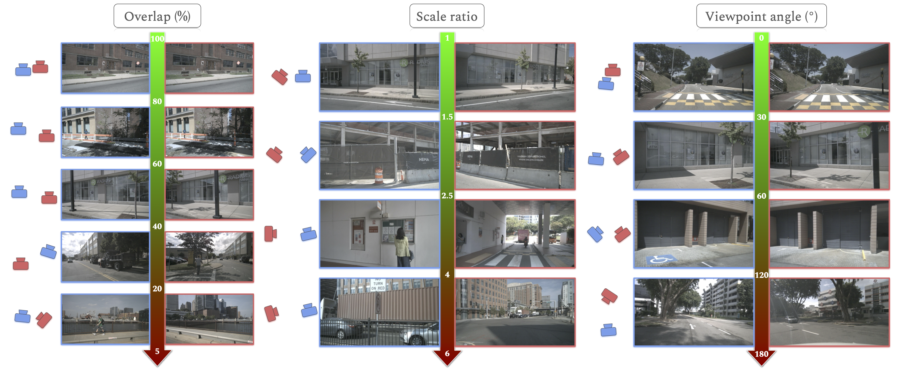

<div align="center">

# RUBIK: A Structured Benchmark for Image Matching across Geometric Challenges (CVPR 2025)

<a href="https://thibautloiseau.github.io"><strong>Thibaut Loiseau</strong></a>
·
<a href="https://gbourmaud.github.io"><strong>Guillaume Bourmaud</strong></a>
</div>

<div align="center">
    <a href="https://arxiv.org/abs/2502.19955" class="button"><b>[Paper]</b></a>
</div>

<br/>



This repository contains the code and data for the CVPR 2025 paper "RUBIK: A Structured Benchmark for Image Matching across Geometric Challenges". RUBIK is a structured benchmark designed to evaluate the geometric robustness of image matching methods across various challenging scenarios.

## Overview

RUBIK is built upon the nuScenes test set and provides a comprehensive evaluation framework for both dense-based and descriptor-based image matching methods. The benchmark includes:

- A curated set of 16.5k image pairs with defined geometric criteria (overlap, line of sight angle, scale ratio) and 33 difficulty levels
- Ground truth relative metric poses for each pair
- Tools for evaluating image matching methods
- Integration with UniDepth for metric scale extraction

## Dataset Requirements

### nuScenes Dataset
RUBIK uses the nuScenes test set as its foundation. You need to download it from [nuScenes website](https://www.nuscenes.org/). You will have to create an account.

### UniDepth
For metric scale extraction, the benchmark uses UniDepth. The necessary scripts for depth extraction are provided in this repository.

## Installation

```bash
# Clone the repository
git clone https://github.com/thibautloiseau/RUBIK.git
cd RUBIK

# Install dependencies
pip install -r requirements.txt
```

## Usage

### 1. Dataset Preparation
- Download the nuScenes test set
- Run the depth extraction script for all images in the benchmark:
```bash
python scripts/extract_depths.py --nuscenes_path [YOUR_NUSCENES_PATH]
```

### 2. Running the Benchmark
The benchmark provides a unified evaluation pipeline for both detector-based and detector-free methods:

```bash
python evaluate.py --method [METHOD_NAME]
```

The list of evaluated methods is in the ``evaluate.py`` file. All required packages for all evaluated methods should already be installed by our ``requirements.txt``file, but you might have to download the weights of some models yourself on the corresponding repositories.

Running this script will return a .json file with the results of all individual pairs in the benchmark from which you can compute statistics.

## Citation
If you use RUBIK in your research, please cite our paper:
```bibtex
@inproceedings{loiseau2025rubik,
  title={Rubik: A structured benchmark for image matching across geometric challenges},
  author={Loiseau, Thibaut and Bourmaud, Guillaume},
  booktitle={Proceedings of the Computer Vision and Pattern Recognition Conference},
  pages={27070--27080},
  year={2025}
}
```